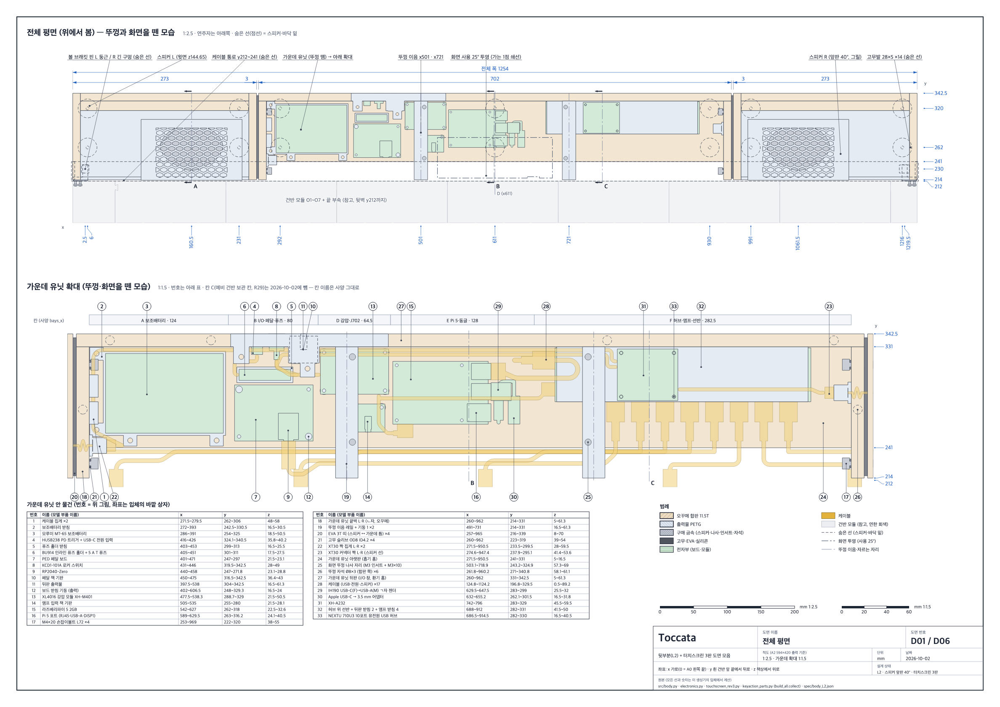
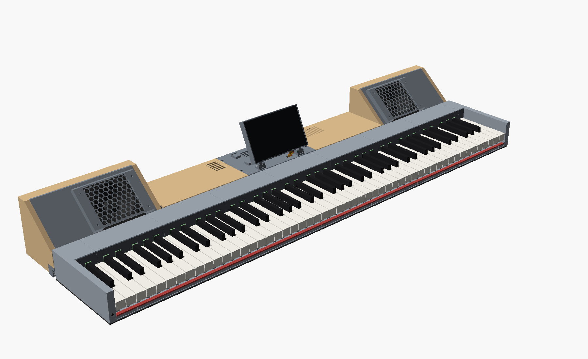
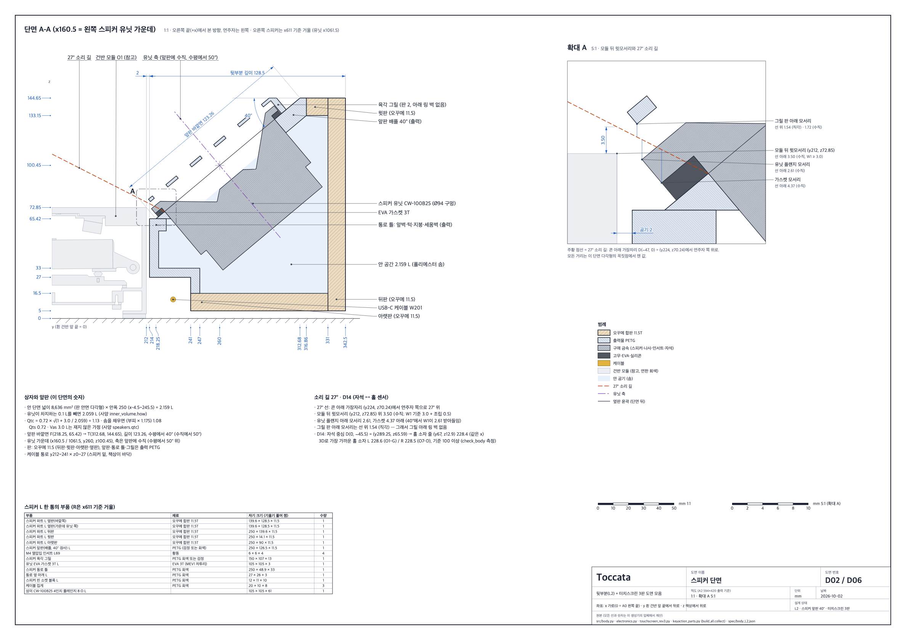
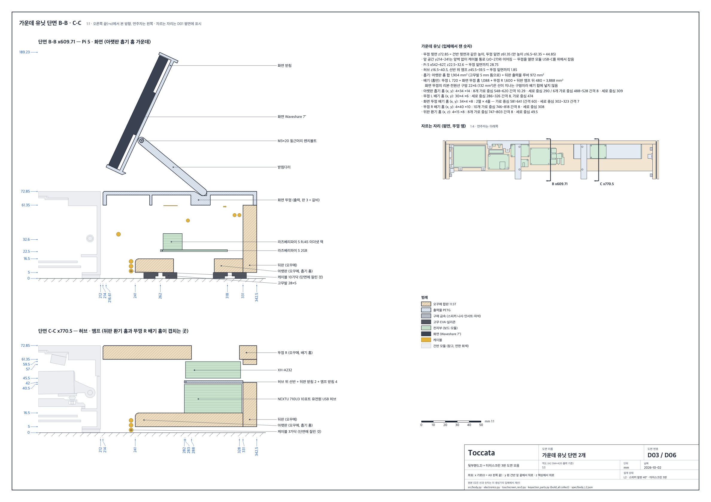
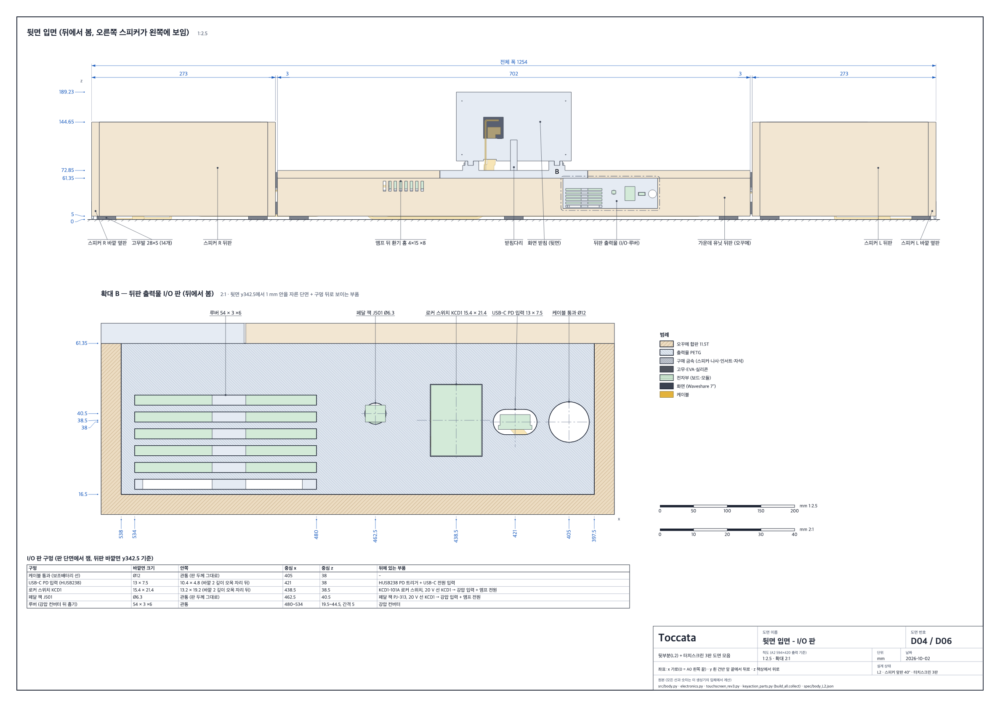
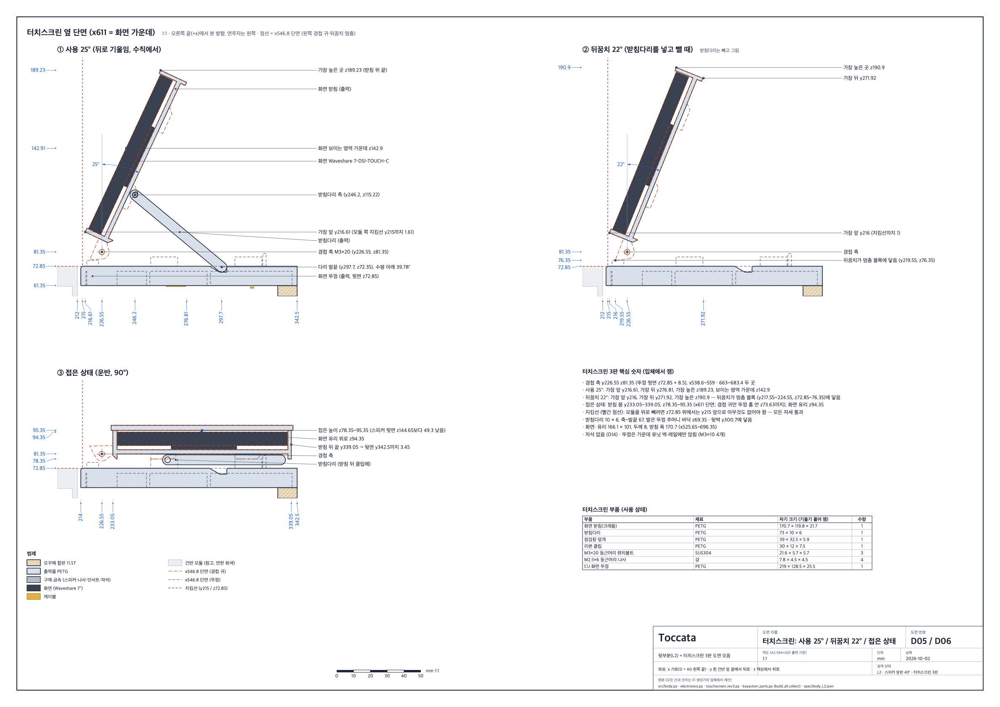

# Toccata 하드웨어 설계서 v4 (확정본, 2026-10-02)

> 이 문서는 지금 확정된 설계를 한곳에 모은 요약입니다. 숫자는 모두 아래 원본 파일에서 옮겼고, 자세한 계산과 도면은 링크를 따라가면 됩니다.
> 원본끼리 값이 다르면 가장 새 것을 썼습니다. 뒷바는 CAD README와 `body_L2.json`의 `angle_decision`, 돈은 구매 목록 엑셀과 최종 재료 아티팩트를 따릅니다. 다른 곳은 [부록 A](#부록-a-출처끼리-다른-값)에 적었습니다.
> 이전 설계서(v2.0 모노리식)는 [archive/v2.0-monolithic.md](archive/v2.0-monolithic.md)에 보관했습니다.

**좌표 (mm).** x는 가로이고 0은 A0 왼쪽 경계입니다. y는 흰건반 앞끝에서 뒤로 갑니다. z는 책상에서 위로 갑니다. 모든 원본이 같은 좌표를 씁니다.

**통합 보고서(진행·재료 선택·회로도·CAD 탭):** https://claude.ai/artifact/4GRdsojXgi8FT78uvbj5Df

---

## 1. 개요와 요구사항 요약

Toccata는 3D 프린터로 만드는 88건반 디지털 피아노입니다. 건반 밑 자석의 거리를 홀센서로 연속해서 재고, 옥타브 모듈마다 작은 MCU(마이크로컨트롤러: 센서를 읽는 작은 컴퓨터 칩)가 USB-MIDI 신호를 만듭니다. 라즈베리파이 5가 FluidSynth로 피아노 소리를 내고, 본체에 붙은 스피커 2개로 냅니다. 같은 피아노를 컨트롤러로 쓰는 리듬게임이 2단계입니다([02-rhythm-game-design.md](02-rhythm-game-design.md)).

모든 설계의 기준은 [sound-requirements.md](../hardware/mechanical/sound-requirements.md)의 요구사항 **R1~R32**(사용자가 말한 것)와 도출 조건 **D1~D24**(조사에서 나온 기술 조건)입니다.

| 묶음 | 요구 | 이 설계에서 어떻게 지키나 |
|---|---|---|
| 음원 | R1~R6, R9~R11 | Pi 5에서 FluidSynth(소프트웨어 신스)를 돌립니다. 세기·속도에 따라 소리가 달라지고, 88키·시간 제한이 없습니다. 하드웨어는 그대로 두고 음원만 바꿀 수 있습니다(R9) |
| 입력 | R7, R8, R24 | 건반마다 선형 홀센서가 자석 거리를 연속으로 잽니다. 페달은 댐퍼 하나이고 연속값(하프페달)을 보냅니다(D1) |
| 소리 출력 | R12~R16, R25 | 4인치 풀레인지 2개 + 싼 D급 앰프 보드(열이 적은 스위칭 방식 앰프) + USB 오디오 동글. 헤드폰을 꽂으면 스피커가 꺼집니다(R15). 서브우퍼는 없습니다 |
| 제작 | R17~R22 | 도~시 12건반 옥타브 모듈 7개 + 끝 부속 2개. 모듈은 따로 떼어 들고 다닙니다. PCB 대신 만능기판에 손 납땜(R19), 출력은 PETG(R20) |
| 건반 구조 | R22, R23 | v4는 무게로 돌아오는 짧은 시소 건반입니다. 참고 영상의 '휘는 플라스틱'은 v3에서 써 봤지만 오래 두면 처지는 문제가 1순위 위험이라, 늘 휘어 있는 플라스틱이 없는 구조로 바꿨습니다(3장) |
| 비용 | R21 | 실제로 살 금액은 **731,485원**입니다(가진 부품·예비 제외, 배송비 포함). 한도(R21)는 전체 구매 목록의 기본 구성 754,492원으로 보며 100만 원 안입니다(8장) |
| 본체 모양 | R26~R28, R32 | 건반 바로 뒤에 붙는 한 몸 뒷바(L2). 평면이 직사각형이고 선이 거의 보이지 않습니다(배기 홈과 건반 뒤 2 mm 틈으로만 조금). 보조배터리 칸이 있습니다(R28) |
| 보관 칸 | R29 | **뺐습니다.** 사용자 승인 2026-10-02 ("보관 칸은 빼도 돼"). 이유는 5.8절 |
| 스피커 각도 | R30 → R32 | R30(L1, 앞판이 수직에서 30° = 수평에서 60°)은 R32 L2로 바뀌었습니다. 앞판은 수평에서 **40°**입니다(사용자 2026-10-01) |
| 터치스크린 | R31 | Waveshare 7-DSI-TOUCH-C를 가운데 화면 뚜껑에 25°로 세웁니다(3판, 6장) |

도출 조건은 이렇게 나뉩니다.
- **D1~D5 펌웨어:** 페달 연속값, 정식 Note Off, 모듈별 USB 이름, 보정은 펌웨어에.
- **D6~D11 Pi·소프트웨어:** 입력 병합은 한 곳, ALSA `hw:` 직결 48 kHz, 키→소리 10 ms 미만, 디지털 피크 −3~−6 dBFS(디지털 최대값보다 3~6 dB 낮게).
- **D12~D19 스피커·전원:** 상자에 넣기, 센서와 10 cm 이상(D14), 진동 격리(D15), Pi는 강압 5.1 V 하나로만 급전(D16), 연주자 쪽 겨냥(D17), 고역 통과 필터·리미터(소리가 정한 크기를 넘지 않게 누르는 기능, D18), PD 60 W 이상(D19).
- **D20~D24 터치스크린:** 화면 연결·OS, 메뉴는 소리를 직접 내지 않음, 받침·경첩, 화면 뚜껑 고정, 리본 경로.

## 2. 전체 구성과 크기

[](../hardware/mechanical/cad/drawings/D01_plan.svg)

[](../hardware/mechanical/cad/renders/R01_front.png)

**평면은 1254 × 342.5 mm 직사각형입니다** (x−16~1238, y0~342.5). 뒤로 튀어나오는 래치가 없습니다. 이전 L1(깊이 447, 래치 포함 471)보다 건반 뒤 면적이 44.5 % 줄었습니다(163,647 mm²).

**가로(x)**

| x | 부분 |
|---|---|
| −16~47 | 왼쪽 끝 부속 EL (A0·A#0·B0, 볼 포함) |
| 47~1198.5 | 옥타브 모듈 O1~O7. 모듈 Ok는 x = 47 + 164.5·(k−1)에서 시작 (흰건반 피치 23.5) |
| 1198.5~1238 | 오른쪽 끝 부속 ER (C8) |
| 뒷바: −16~257 / 260~962 / 965~1238 | 스피커 L / 가운데 유닛 / 스피커 R (사이 틈 3 mm에 EVA 띠) |

**깊이(y)**

| y | 부분 |
|---|---|
| 0~212 | 건반 모듈 (흰건반 y0~199, 모듈 뒷벽 y209~212) |
| 212~214 | 공기 틈 2.0 mm. 뒷바가 모듈에 딱딱하게 닿지 않게 합니다(D15) |
| 214~342.5 | L2 한 몸 뒷바 (건반 뒤 130.5) |
| 212~241 × z0~27 | 뒷바 밑의 닫힌 선 통로 (모듈 USB 선) |

**높이(z)**

| 무엇 | z |
|---|---|
| 모듈 프레임 바닥 (밑에 EVA 3T) | 3 |
| 스피커·가운데 상자 바닥 (고무발 5 mm 위) | 5 |
| 흰건반 / 검은건반 윗면 (쉼) | 43.5 / 55.5 |
| 모듈 맨 위 = 가운데 뚜껑 윗면 | **72.85** (모듈과 뒷바 가운데가 같은 높이) |
| 스피커 윗면 | **144.65** |
| 터치스크린 (사용 25°) 화면 보이는 영역 가운데 / 화면 받침 맨 위 | 142.91 / **189.23** |
| 접은 터치스크린 | 78.35~95.35 |

**무게.** 옥타브 모듈 1개 1.37 kg, 88건반 본체 약 10.6 kg입니다([DESIGN.md 4장](../hardware/mechanical/key-action-v4/DESIGN.md)). 뒷바만 약 3.3 kg으로 추정합니다(D22).

**나눠 드는 단위(R18, R26).** 옥타브 모듈 7개, 끝 부속 2개, 스피커 L·R, 가운데 유닛(화면 포함). 모듈끼리는 도브테일(비둘기 꼬리 모양의 혀와 홈)로 위에서 내려 끼웁니다. 뒷바는 끝 부속 볼의 브래킷 핀에 얹힙니다(5.5절).

## 3. 건반 액션 v4 (W1+ r4.5)

원본: [key-action-v4/DESIGN.md](../hardware/mechanical/key-action-v4/DESIGN.md) (r4.5 회로 2차 대조, 2026-09-29) · 요약 [README](../hardware/mechanical/key-action-v4/README.md) · 도면 15장 [`drawings/`](../hardware/mechanical/key-action-v4/drawings/)

### 3.1 구조

1. **건반:** Ø4 스테인리스(SUS304) 봉 위의 짧은 시소입니다. 봉 중심은 (y141, z21.5)입니다. 스냅 노치가 봉을 감싸고, 밸런스 핀(Ø2, y135.3)이 건반 뒤쪽을 옆으로 잡습니다.
2. **무게 레버:** 건반 꼬리의 M3 캡스턴 나사(높이 조절 나사)가 레버를 들어 올립니다. 레버는 출력 캐리어에 강철 블록 9×19×40(약 54 g)을 **MS 폴리머 탄성 접착제**로 붙인 것이고, 또 다른 Ø4 봉(y203.25, z33.5)에서 돕니다. 5분 에폭시는 온도가 바뀌면 떨어져서 쓰지 않습니다.
3. **복귀:** 손을 떼면 레버 무게와 작은 비틀림 스프링이 건반을 되돌립니다. 스프링은 **미스미 C-UA90R5-3-0.5**(SUS304-WPB, 안지름 5, 선 0.5, 3권)를 다리 22.3 / 8.0 mm로 잘라 씁니다. 짧은 다리는 레버 허브의 가둠 홈에 들어가 코일이 봉에 닿지 않습니다. 쉼 토크 4.19 N·mm, k_t 8.44 N·mm/rad.
4. **맞물림:** 건반과 레버는 홈 없이 눌려 붙어 있어 유격이 없습니다. 예하중이 걸린 이음도 없습니다.
5. **업스톱(위 멈춤):** 끝까지 누르면 레버 강철 윗면이 프레임 윗판 밑 패드(미세셀 우레탄 6T + 펠트 1T)에 닿습니다. 패드는 앞으로 빼낼 수 있는 패드 바 4개에 붙어 있습니다.
6. **센서 자석:** 건반 밑 자석 Ø5×2 N35가 센서 줄(y67) 바로 위에 옵니다.
7. **제어 기판:** 모듈을 뒤집어 바닥 구멍으로 밑에서 넣고, 매단 보스에 M3×6 2개로 조입니다.

### 3.2 결과 (모델 판정 45개 모두 통과)

| 항목 | 흰건반 / 검은건반 | 목표 |
|---|---|---|
| 누르는 힘(다운웨이트, DW) | 51.9 / 51.0 g | 47~55 g |
| 올라오는 힘(업웨이트, UW) | 42.8 / 40.8 g | 20 g 이상 |
| 연타 | 16.3 / 18.8 Hz (마찰 2배 15.2 Hz) | 13.3 Hz 이상 |
| 유효 질량 | 55.2 / 46.5 g | 참고 |
| 쉬는 동안 플라스틱 최대 응력 | 0.50 MPa | 2 MPa 미만 |
| 움직이는 부품 최소 틈 | 1.31 mm (공차 ±0.3 뒤 1.01) | 1.0 이상 |
| 6건반 화음 자리 윗판 강성 | 491.6 N/mm | 460 이상 |
| 자석–센서 간격 | 흰 쉼 10.82 · 바닥 5.60 / 검 쉼 13.35 · 바닥 5.32 mm | 과다 누름에도 3.0 이상 (4.76) |
| 모듈 맨 위 | z72.85 | z74 이하 |
| 모듈 무게 · 크기 | 1.37 kg · 164.5 × 212 mm | 1.6 kg 이하 |
| 부품 (모듈당) | 출력 32 + 구매 88 | — |

검증 기준은 보통 연주(건반 앞끝 1.5 m/s까지)에서 모든 기능 목표를 지키고, 2.5 m/s 내려치기에서는 부서지지 않는 것입니다(근거 Askenfelt & Jansson 1991, Goebl 외 2005, DESIGN 0.1절).

### 3.3 모듈과 출력

- 모듈 1개 = 흰건반 7 + 검은건반 5 + 레버 12 + 프레임 1 + 센서 바·패드 바·가림판 띠. 끝 부속은 같은 단면에 볼(cheek)을 붙인 것입니다.
- 흰건반은 윗면을 매끈한 PEI 판(프린터 베드 표면 판)에 대고 뒤집어 뽑습니다. 레버 캐리어는 옆으로 눕히고, 프레임은 바로 세워 윗판 밑에만 트리 서포트(나무 모양으로 뻗는 받침 출력, 모듈당 약 88 g)를 씁니다.
- 88건반 전체 필라멘트는 서포트를 포함해 6.55 kg, 출력 436시간입니다(DESIGN 15장). 건반 액션 부품은 모두 220 × 220 베드에 들어갑니다(뒷바 앞판은 256 베드, 9.1절).

### 3.4 아직 확인할 것 (DESIGN 18장, README '남은 일')

- **패드 재료 반발 — 가장 큰 위험.** 모든 결과는 업스톱 패드가 거의 튀지 않는다는 가정(계 실효 반발 계수 e 0.06, 합격선 0.07, 폼 E 1.0 MPa)입니다. 카탈로그 재료는 더 튈 수 있고, e가 0.15~0.25면 가벼운 누름의 유령 음과 세게 칠 때 건반 들림이 한계를 넘습니다 → **단계 0 시험 1을 가장 먼저** 합니다.
- **6건반 화음 자리 여유 6.4 %.** 윗판 강성 491.6 N/mm는 합격선 460의 1.07배뿐입니다. 출력한 윗판이 모델보다 6 %쯤 더 무르면 미달입니다 → 시험 1 다음에 시험 3a(굽힘 띠), 그리고 21. 낮으면 윗판 채움 100 %, 그래도 낮으면 윗판을 두껍게 합니다.
- MS 폴리머 접착 강도는 가정값입니다 → 단계 0 시험 20.
- 밸런스 레일이 실제로 얼마나 단단히 받쳐지는지 → 첫 모듈 정하중 시험 21.
- 스프링 손 들기 토크가 카탈로그 55° 토크의 104 % → 시험 8·13.
- 흰건반 앞끝 DW 47.1 g(목표 47 g과 0.1 g 차이) → 모자라면 강철 앞 윗면에 퍼티.
- **끝 부속 쐐기 얇은 끝**이 A0 0.29 / C8 0.26 mm로 설계 최소 0.3보다 얇습니다(한 층 0.2 이상이라 출력은 됨) → 출력해 보고, 안 되면 그 건반 자리만 패드 바 밑면을 0.1 올립니다.
- 강철 블록 두께는 8.9~9.1 mm만 씁니다. 업스톱 패드는 6T가 설계값입니다(건반 액션 README는 6T 구매를 권함). 구매 목록은 PORON 5T를 사므로 `stl/print/04`의 패드 바는 5T용(쐐기 1.0 두껍게)입니다. 6T를 사면 `stl/print_extra/대안_패드바_PORON6T용`을 대신 뽑습니다(9.1절, 부록 A).

## 4. 센싱·회로

원본: [hardware/pcb/README.md](../hardware/pcb/README.md) — 회로도 **개정 C** (2026-10-01, △16: 터치스크린 전원 `+5V_PI`). 바뀐 SCH-01·SCH-06만 C이고 나머지 7장은 B(2026-09-29)입니다.

### 4.1 보드와 센서

| 보드 | 개수 | 내용 |
|---|---|---|
| 센서 기판 SB | 7 | 홀센서 **DRV5055A2QLPG** 12개(선형, 3.3 V). 센서 바 포켓에 눕혀 넣음. 리본 16심(2×8)으로 제어 기판에 |
| 제어 기판 MB | 7 | **RP2040-Zero** + **CD74HC4067** 16채널 먹스(센서 16개 중 하나를 골라 읽게 하는 스위치 칩) 모듈. 만능기판 손 납땜(R19). 모듈마다 USB-C 하나 |
| 끝 부속 EL / ER | 1 / 1 | A0·A#0·B0 / C8 센서. JST-XH 연장선(EXT)으로 O1 / O7 제어 기판이 읽음 |
| 페달 PB + PS | 1 + 1 | 페달 보드(RP2040-Zero = `PED`)와 페달 안 홀센서. 댐퍼 하나, 연속값 |

- 홀센서는 88 + 페달 1 = 89개를 쓰고 예비 11개를 삽니다. RP2040-Zero는 8개입니다.
- 센서 출력은 흰건반 약 4 → 22 mT, 검은건반 약 2 → 25 mT입니다. 최대 31 mT로 선형 범위 ±44 mT 안입니다.
- **재무장선**은 자석이 50 % 돌아온 곳입니다. **유령 거름**: 같은 건반에서 0.3 m/s 이상 음의 note-on부터 250 ms 안에 재무장하면 의심 상태가 되고, 500 ms 안의 첫 다시 눌림이 앞 음 속도의 25 %(최대 0.45 m/s) 미만이면 버립니다.

### 4.2 USB-MIDI

- 모듈 7개와 페달이 각각 USB-MIDI 장치 8개로 보입니다. 이름은 `Toccata O1`~`O7`, `Toccata PED`입니다(D3).
- 8개 모두 10포트 유전원 허브(NEXTU 710U3)를 거쳐 Pi 5로 갑니다. 허브를 PC에 꽂으면 PC에서도 MIDI 장치 8개로 보입니다.

### 4.3 전원

```
USB-C PD 20 V (65 W 충전기 또는 보조배터리)
 → HUSB238 PD 트리거 → 5 A 퓨즈 → KCD1 로커 스위치 → 20 V 버스
     ├→ XH-A232 앰프 (20 V)
     └→ XL4016 강압 5.1 V ─→ Pi 5 (측면 꺾임 USB-C 선) ─→ 화면 (GPIO 2번 5 V · 6번 GND)
                           └→ USB 허브 (DC 잭)
```

- Pi는 강압 5.1 V 하나로만 급전합니다(D16, EEPROM `PSU_MAX_CURRENT=5000`). 화면은 Pi에서 나가는 방향으로만 전원을 받습니다(약 2.15 W).
- 평균 전력은 화면 포함 15.69~19.69 W, 최대 음량 저음 화음 순간 최대 약 **54.4 W**입니다. PD 60 W까지 여유 약 5.6 W입니다. 45 W 전원이면 볼륨 상한을 2 dB 낮춥니다(D19).
- 보조배터리(74 Wh × 0.85 ≈ 62.9 Wh 기준)로 약 **3.2~4.0시간** 씁니다.
- 별 접지점은 강압 IN− 단자입니다(험 방지, △5).

### 4.4 오디오

```
Pi 5 USB-A → ㄱ자 젠더 → Apple USB-C 3.5 mm 동글 → 헤드폰 잭(노멀 접점, 왼쪽 볼)
 → 앰프 입력 잭 → RC 고역 통과 약 93 Hz → XH-A232 (TPA3110, 36 dB) → XT30 → CW-100B25 ×2
```

- 헤드폰을 꽂으면 노멀 접점(플러그가 없을 때만 붙어 있는 잭 안의 스위치)이 열려 앰프 입력이 끊깁니다(R15).
- 동글은 허브를 거치지 않고 Pi에 바로 꽂습니다. 출력이 0.5~1 Vrms라 소프트웨어 음량 상한이 꼭 필요합니다.
- 스피커 앞에 직렬 콘덴서(베이스 블로커)를 두지 않습니다(D13).

## 5. 뒷부분 L2 (한 몸 뒷바)

원본: [cad/README.md](../hardware/mechanical/cad/README.md) · 사양 [cad/spec/body_L2.json](../hardware/mechanical/cad/spec/body_L2.json) (`selected_angle` 40, `angle_decision`, `w1_acoustic_check`) · 요구 R32

사용자 요청(2026-10-01)은 "건반과 뒤 부품을 합쳐서 뒤 영역을 최대한 줄이고, 케이블이 밖으로 안 나오게, 스피커는 더 눕히고 작게"였습니다. 처음 L2는 43°였고, 같은 날 사용자가 **40°**로 바꿨습니다. W1 음향 확인을 통과했습니다(조건부). `src/body.py`의 `ANGLE = 40` 한 줄에서 스피커 수치가 모두 계산됩니다.

### 5.1 스피커 파트 (40°)

[](../hardware/mechanical/cad/drawings/D02_speaker_section.svg)

| 항목 | 값 |
|---|---|
| 바깥 크기 | 273 × 128.5 × 139.65 (z5~144.65), L x−16~257 · R x965~1238 |
| 상자 | 오꾸메 합판 11.5T(옆·뒤·위·아래) + 출력 앞판(배플) + 출력 통로 틀. 밀폐형 |
| 앞판 | 수평에서 **40°**(수직에서 50°), 경사 길이 123.26 |
| 유닛 | 삼미 CW-100B25 4인치 풀레인지 8 Ω. 중심 (x160.5 / 1061.5, y260, z100.45). 앞판의 M4 열압입 인서트 + M4×12, EVA 가스켓 3T |
| 안 부피 | 2.159 L (유닛 빼면 2.059 L; W1 권장 2.0 L 이상, 최저 1.8 L) |
| Qtc / Fc | **1.13**, 141~201 Hz (Vas 3 L 가정). 흡음솜을 넣으면 약 **1.08**, 135~192 Hz. Vas가 4 L면 약 1.24라 솜은 꼭 넣습니다 |
| 겨냥 | 유닛 축이 수평 위 50°. 앉은 연주자 가운데 귀(y−300, z460)는 32.7° 위라 17.3° 어긋남 (W1 한계 20°) |
| 그릴 | 판 2 mm, 구멍 95개(모두 Ø3 이상), 개구율 70.4 %. 나사 4개로 떨리지 않게 고정 |
| 폴 벤트(자석 가운데 공기 구멍) | 자석 뒤 축 방향 55.6 mm 비어 있음 (W1 조건 10 mm 이상) |

**용어.** Qtc는 상자 속 공기가 저음을 얼마나 부풀리는지 나타내는 값입니다. 1 근처가 좋고, 크면 저음이 붕붕 울립니다. Fc는 저음이 줄기 시작하는 주파수, Vas는 스피커 진동판의 부드러움을 같은 힘을 내는 공기 부피로 나타낸 값입니다.

**흡음솜(Qtc를 낮추는 솜)** 은 폴리에스터를 상자 전체에 느슨하게 넣습니다(상자마다 약 35 g). 유닛 뒤 10 mm와 폴 벤트 앞은 비웁니다. 첫 x 방향 공진(약 686 Hz)도 이 솜으로 줄입니다. 앰프 입력 RC 필터가 약 93 Hz 아래를 자릅니다(D18).

### 5.2 소리 길과 센서 거리

- **27° 소리 길:** Ø94 구멍 아래 가장자리에서 연주자 쪽 27° 선이 모듈 뒤 윗모서리(y212, z72.85) 위 **3.50 mm**로 지납니다(W1 기준 3.0 이상).
- 유닛 플랜지 아래 모서리는 선 아래 2.61 mm입니다. W1 엄격 기준 3.0보다 작지만, 유닛 자기 테두리라 W1이 받아들였습니다(`angle_decision`). 실제로 소리가 나오는 가장자리에서 그은 선은 8.64 mm 위로 지납니다.
- 그릴 판 아래 모서리만 선이 판 밑 1.72 mm(수직)로 지나갑니다. 판이 구멍 뚫린 격자라 W1이 승인한 예외입니다.
- **D14:** 스피커 자석 중심에서 가장 가까운 홀센서까지 3D **228.5 mm**, 가장 가까운 쇠(플랜지 아래 모서리)까지 159.7 mm입니다(기준 100 mm 이상). 88개 센서가 모두 y67 한 줄이라 끝 부속까지 같습니다.
- **D15:** 스피커는 모듈에 닿지 않습니다. 앞은 2.0 mm 공기 틈이고, 실리콘 그로밋 브래킷 핀에 얹힙니다. 가운데와는 EVA 띠와 고무 슬리브로만 이어집니다. 모듈에 나사로 박는 것이 없습니다.

### 5.3 가운데 유닛 (x260~962)

[](../hardware/mechanical/cad/drawings/D03_centre_sections.svg)

- 오꾸메 합판 상자(아랫판·끝벽 2·뒤판)이고 **앞벽이 없습니다.** 뚜껑을 열면 앞 공간(y214~241)에서 모듈 USB-C 플러그를 위에서 바로 잡습니다.
- 안 높이는 44.85 mm(z16.5~61.35)입니다. 뚜껑 윗면을 모듈 맨 위 높이 z72.85에 맞췄기 때문입니다.
- 뚜껑 3장: **뚜껑 L**(x260~501, 오꾸메, 자석 3쌍) · **화면 뚜껑**(x501.5~720.5, PETG 출력, M3×10 4개) · **뚜껑 R**(x721~962, 오꾸메, 자석 3쌍). 모두 가운데 유닛 벽·레일·기둥에만 얹혀 모듈에 힘이 가지 않습니다.

| 칸 | x | 들어가는 것 |
|---|---|---|
| A | 271.5~395.5 | 보조배터리 (받침 출력물, 벨크로 끈) |
| B | 395.5~475.5 | 뒤판 I/O, 페달 보드(PED), 퓨즈 |
| D | 475.5~540 | XL4016 강압, 앰프 입력 잭 기판(J702) |
| E | 540~668 | Pi 5, USB 오디오 동글 |
| F | 668~950.5 | USB 허브(바닥), 앰프(허브 위 선반) |

**뒤판 I/O**(출력물, x397.5~538): 케이블 통과 Ø12, USB-C PD 입력, 로커 스위치 KCD1, 페달 잭이 있습니다. 스위치 테두리와 페달 잭 끝은 뒤판 바깥면(y342.5)과 같은 면이고, USB-C 입구는 2 mm 안쪽입니다.

[](../hardware/mechanical/cad/drawings/D04_rear_elevation.svg)

**열.** 안에서 약 12 W가 납니다. 아랫판 흡기 홈, 뒤판 루버, 뚜껑 배기 홈으로 굴뚝처럼 빠집니다. 최대 부하에서 `vcgencmd get_throttled`가 0x0인지 보고, 안 되면 Pi Active Cooler(+8,000원)를 답니다.

### 5.4 선 통로

- 뒷바 밑에 닫힌 통로 y212~241 × z0~27(단면 783 mm²)이 있습니다. 바닥은 책상이고, 스피커 밑은 출력 통로 지붕, 가운데는 위로 열린 앞 공간입니다. 양 끝은 출력 마개로 막아 옆에서 선이 보이지 않습니다.
- 모듈 USB 선은 통로를 따라 가운데 앞 공간으로 올라가 허브 포트에 꽂힙니다. 포트 배치: 2 PED, 3 O3, 4 O1, 5 O2, 6 O4, 7 O5, 8 O6, 9 O7. 포트 0·1(화면 뚜껑 아래)은 비워 둡니다.
- 가장 붐비는 허브 앞에서도 USB 선 7개가 약 88 mm²라 통로에 넉넉합니다.

### 5.5 결합

- **뒷바 ↔ 건반:** 끝 부속 볼 뒤의 방진 브래킷 BRK2(실리콘 그로밋 + M3×16)에 Ø6 핀이 서 있습니다. 스피커 통로 지붕 밑 소켓이 그 핀에 얹힙니다. L은 둥근 구멍, R은 긴 구멍이라 1254 mm 폭을 무리하게 묶지 않습니다.
- **스피커 ↔ 가운데:** 한쪽에 M4 손잡이볼트 2개(M4×20, 최대 M4×22)입니다. 가운데 안에서 끝벽의 고무 슬리브를 지나 스피커 안쪽 옆판의 나사산 인서트(Norelem 07653-04)에 들어갑니다. 3 mm 틈에는 EVA 3T 띠 2줄을 둡니다.
- 스피커 선은 XT30 커넥터로 끝벽에서 끊습니다. 스피커를 들어내는 순서는 [CAD README '분해·점검'](../hardware/mechanical/cad/README.md)에 있습니다.

### 5.6 발

화성고무 피스고무발 28×5 **14개**(스피커마다 4, 가운데 6)입니다. 모두 통로 뒤(y≥248)에 있습니다. 나사는 직결피스 8호 **13 mm 이하**입니다. 16 mm 이상이면 스피커 밀폐 바닥을 뚫습니다. 스피커 아랫판 나사 구멍에는 MS 폴리머를 한 방울 넣습니다.

### 5.7 합판

오꾸메 11.5T **400 × 1200 한 장**에서 16조각을 뽑습니다(배치는 [D06](../hardware/mechanical/cad/drawings/D06_plywood_cuts.svg)). 스피커 안쪽 옆판과 가운데 끝벽은 L과 R의 구멍 자리가 달라 D06에 따로(P4L·P4R, P5L·P5R) 그렸습니다. 막힌 구멍(인서트 Ø5.8 × 8, 뚜껑 자석 Ø8 × 3.2)과 끝벽·뒤판 윗모서리 자석 자리 Ø8 × 3.2는 판을 붙이기 전에 뚫습니다. 판매처가 이 배치대로 자르지 못하면 600 × 1200을 삽니다(+22,520원). 구멍·홈·자석 자리는 출력 지그 24개(`stl/print/08_합판지그`, 쓰는 법 [cad/jigs/README.md](../hardware/mechanical/cad/jigs/README.md))를 대고 가진 전동 드릴로 뚫습니다 — 공구는 새로 사지 않습니다. 폭 4 mm 홈 38개는 직소 날이 들어가지 않아 J-d 지그(틀 + 슬라이더 + 심)로 Ø4 구멍을 네 번에 나눠 촘촘히 뚫습니다(줄질 필요 없음; 홈 사이 나무 4 mm, 가운데 아랫판 Pi 아래 8개만 6.29 mm). 모서리 자석 자리는 포스트너 비트 대신 J-b 새들 + Ø8 트위스트 드릴로 팝니다. J-b는 틈 11.3 · 11.6 · 11.9 · 12.2 네 개를 **모두 뽑아** 실제 판 두께에 맞는 하나를 씁니다.

### 5.8 예비 건반 보관 칸 (R29) — 뺐음

- 사용자 승인: 2026-10-02 ("보관 칸은 빼도 돼").
- 이유: 가운데 안 높이가 44.85 mm뿐인데 예비 건반 2층은 58.8 mm가 필요합니다. 안폭 679 mm도 전자부로 꽉 찹니다. 칸을 두면 높이나 깊이가 커집니다.
- 대안(모델에 없음, 필요하면 만듦): (a) 따로 출력하는 예비 부품 상자 약 210 × 180 × 65, (b) 가운데 뒤에 붙였다 떼는 칸(붙이면 깊이 +170).

## 6. 터치스크린 3판 (R31)

원본: [CAD_SPEC_rev3.md](../hardware/mechanical/touchscreen/rev3/design/CAD_SPEC_rev3.md) · [numbers.json](../hardware/mechanical/touchscreen/rev3/design/numbers.json) (3a, 사용자 승인 2026-10-01) · 도면 [t01~t06](../hardware/mechanical/touchscreen/rev3/drawings/) · CAD 값은 [cad/README.md 부록 A10](../hardware/mechanical/cad/README.md)

[](../hardware/mechanical/cad/drawings/D05_touchscreen.svg)

| 항목 | 값 |
|---|---|
| 화면 | **Waveshare 7-DSI-TOUCH-C** — 7인치, 가로 1024×600, DSI, 정전식 터치 5점. 166.1 × 101.0 × 8.0 mm |
| 자리 | 가운데 화면 뚜껑(x501.5~720.5). 화면 가운데 x611 |
| 경첩 축 | **y226.55, z81.35**. 경첩 2개 M3×20 (x538.6~559.0 · x663.0~683.4, 나사는 바깥에서) |
| 사용 각도 | **25°** 뒤로 기울임. 뒤꿈치가 22°에서 멈춤 블록에 닿아 앞으로 3° 놀이 |
| 화면 위치 (25°) | 화면 보이는 영역 가운데 y240.91 **z142.91**, 화면 받침 맨 위 **z189.23**, 받침 가장 앞 y216.61 |
| 받침다리 | 길이 67 mm, 수평에서 39.78°. 화면을 22°에 댄 채 넣고 뺍니다(25°에서 넣으면 발이 뒷벽 모서리를 0.66 mm 긁음) |
| 접은 상태 | 다리를 받침 뒤 클립에 끼우고 뒤로 접음: **z78.35~95.35**, y233.05~339.05 (뚜껑 뒤끝 y342.5 안쪽 3.45, 스피커 윗면 아래 49.3) |
| 화면 고정 | 받침(PETG 170.7 × 106.0 × 17.0) 뒤에서 M2.5×6 4개로 화면 모서리 구멍(154 × 88)에 |
| 뚜껑 고정 | M3×10 4개(y246·y322, x506·716) → 이음 레일의 M3 열압입 인서트. 자리파기 Ø6.5 × 5.5 |
| 리본 | DSI FFC(얇고 납작한 리본 선) 22핀 0.5 mm 300 mm **B형**(A형은 예비). Pi 5 CAM/DISP 1 → 뚜껑 밑 클립 → 뚜껑 구멍 22×6 → 경첩 고리 → 화면. 필요 약 256 mm |
| 전원 | Pi GPIO 2번(5 V)·6번(GND) → 실리콘 점퍼 → 화면 동봉선 → 화면 MX1.25. 넷 `+5V_PI` (회로 △16) |

- **모듈 위 금지 규칙:** y ≤ 215이면서 z ≥ 72.85인 곳에는 화면 부품도 선도 없습니다. 모듈을 위로 빼야 하기 때문입니다. 22~90°로 돌리는 동안 가장 앞 부품은 y216.0입니다.
- **D14:** 화면·경첩·받침다리에는 자석을 쓰지 않습니다. 화면 가장 앞은 센서 줄에서 149.0 mm 뒤입니다.
- **O4 정비:** O4 모듈 플러그는 화면 뚜껑 밑에 있습니다. 화면을 접고 → 나사 4개를 풀고 → 뚜껑을 화면째 듭니다(리본을 꽂은 채 약 96 mm) → Pi 쪽 리본과 점퍼를 뺍니다.
- **출력:** `07_터치스크린` 5종(받침 약 86 g, 받침다리, 점검창 덮개, 리본 클립, 선택 화면 덮개) + `05`의 화면 뚜껑(약 177 g).
- 추가 재료는 86,674원입니다(구매 목록, 8장).

## 7. 소프트웨어 개요

펌웨어(`firmware/`)와 Pi 소프트웨어(`sw/`)는 아직 코드가 없습니다. 아래는 요구사항이 정한 틀입니다.

### 7.1 OS Lite와 pygame

- **OS:** Raspberry Pi OS Lite 64-bit, 쓰는 판을 고정합니다. 데스크톱 판은 PipeWire를 깔아 오디오 장치 직결(D7)과 부딪힙니다.
- **메뉴·게임:** `python3-pygame`(apt, 시스템 SDL2의 KMSDRM: 데스크톱 없이 화면에 바로 그리는 방식)으로 데스크톱 없이 전체 화면으로 돕니다. 화면이 처음부터 가로 1024×600이라 화면도 터치 좌표도 돌리지 않습니다(D20).
- **화면 설정:** `config.txt` 끝에 `dtoverlay=vc4-kms-dsi-waveshare-panel-v2,7_0_inch_c` 한 줄(CAM/DISP 0이면 `,dsi0`). 밝기는 `/sys/class/backlight/*/brightness`에 0~255. 찬 부팅에서 가끔 화면이 안 켜지면 재부팅합니다.
- **게임 소리:** 믹서를 두지 않습니다. 반주를 MIDI로 FluidSynth에 보내 같은 신스로 냅니다. 오디오 장치를 한 프로그램만 쓰기 때문입니다.

### 7.2 음원

- **FluidSynth** + Salamander Grand Piano SF2(약 296 MB). 모듈 8개 입력 병합은 `midi.autoconnect=1` 한 곳에서만 합니다(D6).
- ALSA `hw:` 직결, 48 kHz, PipeWire 없음(D7). 키→소리 10 ms 미만이 목표입니다(D8).
- 디지털 피크 −3~−6 dBFS(D9), 리미터 `synth.limiter`(D18). 소리 게이트(최악 연주 파일 + 20~300 Hz 스윕)를 통과한 볼륨보다 3 dB 낮은 곳을 상한으로 고정합니다.
- 엔진 전환은 systemd 서비스 전환(`Conflicts=`)으로 합니다(D10). 터치 메뉴는 소리를 직접 내지 않고 FluidSynth 셸(TCP)로 음색·볼륨·리버브·메트로놈 명령을 보냅니다(D21).

### 7.3 펌웨어 규칙 (RP2040-Zero)

- 모듈마다 홀센서 12개를 먹스로 돌아가며 읽고, 자석 위치를 연속으로 재서 속도(벨로시티)를 계산합니다.
- 페달 CC64는 0~127 연속값, 발을 떼면 정확히 0, ±2 이상 변할 때만 보냅니다(D1). Note Off는 `0x80`, 릴리즈 벨로시티 하한 5(D2).
- 건반별 보정은 펌웨어에, 취향 곡선은 음원에 둡니다(D4). 유령 거름 규칙은 4.1절.

### 7.4 리듬게임

기획은 [02-rhythm-game-design.md](02-rhythm-game-design.md)에 있습니다. 같은 하드웨어를 컨트롤러로 쓰고, 7인치 화면 또는 HDMI TV에서 돕니다.

## 8. 재료·비용

**실제로 살 금액은 731,485원입니다** (부품 683,385원 + 배송비 48,100원). 사용자가 이미 가진 부품과 예비를 뺀 금액입니다.
- 출처: 최종 재료 아티팩트 https://claude.ai/artifact/9CJ3HwhbhoodCAui94g28n 의 db `state/main` (2026-10-02 10:30 KST 저장본). 생성기와 데이터는 [hardware/bom/final-bom/](../hardware/bom/final-bom/)에 있습니다.

**전체 구매 목록은 1,134,177원입니다.** 이 금액은 가진 부품·공구·소모품·예비까지 **모두 포함한 목록**입니다. 실제로 내는 돈이 아닙니다.
- 출처: [hardware/bom/toccata-purchase-list-v4.xlsx](../hardware/bom/toccata-purchase-list-v4.xlsx) (10/2 NC888 교체 반영, `docs/report/`에 같은 파일). 구매 O로 표시된 줄의 단가 × 수량을 openpyxl로 다시 더해 시트 합계와 같음을 확인했습니다(2026-10-02).

| 구분 | 금액 |
|---|---|
| 기본 구성 (피아노에 들어가는 부품) | 754,492원 |
| 소모품 | 229,536원 |
| 공구 | 150,149원 |
| **합계 (전체 목록)** | **1,134,177원** |
| (참고) v4 부품 추천 절감을 적용하면 | 1,091,558원 |

**한도(R21).** 기본 구성 754,492원은 한도 1,000,000원 안이고 245,508원이 남습니다. 소모품 때문에 넘는 것은 R21이 허용합니다.

**최근 바뀐 몫** ([hardware/bom/README.md](../hardware/bom/README.md))
- R31 터치스크린 3판: +86,674원 (화면 79,900 + 리본·점퍼·나사).
- L2 한 몸 뒷바 + 터치 3판(10/1): −10,730원 (600×1200 합판·토글 래치·직결피스 16 mm 빠짐, 인서트·손잡이볼트·꺾임 선 추가).
- 10/2: 보조배터리 선 C22를 Coms NC888 꺾임 C–C 1 m(2,600원)로 바꿈, −4,670원.

**큰 항목 (기본 구성, 구매 목록 값)**

| 품목 | 금액 |
|---|---|
| Raspberry Pi 5 2GB | 119,900원 |
| DRV5055A2QLPG ×100 | 89,100원 |
| Waveshare 7-DSI-TOUCH-C | 79,900원 |
| 사각철판 9T 19×1000 ×4 (레버 강철 블록) | 34,440원 |
| 미스미 C-UA90R5-3-0.5 비틀림 스프링 ×100 | 31,000원 |
| NEXTU 710U3 10포트 유전원 허브 | 30,700원 |
| RP2040-Zero ×8 | 26,400원 |
| 65 W PD 충전기 PG65 | 19,800원 |
| CW-100B25 스피커 ×2 | 19,200원 |
| 오꾸메 합판 400×1200 (무료 재단) | 17,680원 |

3D 프린터는 이 목록에 없습니다.

## 9. 출력·제작 순서

원본: [cad/README.md](../hardware/mechanical/cad/README.md) (`src/build_all.py`가 설계 모델에서 바로 만든 파일과 안내서) · [DESIGN.md 10·15·17장](../hardware/mechanical/key-action-v4/DESIGN.md)

### 9.1 출력 파일 ([`cad/stl/print/`](../hardware/mechanical/cad/stl/print/))

모양이 같은 부품은 파일 하나이고, 파일 이름 끝 `__7개`가 개수입니다.

| 폴더 | 파일 | 부품 | 재료 |
|---|---|---|---|
| `01_건반` | 14 | 88 | PETG 흰색·검정 |
| `02_레버캐리어` | 16 | 88 | PETG |
| `03_프레임` | 3 | 9 | PETG |
| `04_센서바·패드바·가림판·마개` | 13 | 57 | PETG |
| `05_본체출력물` | 23 | 43 | PETG (스피커 앞판·그릴·통로 틀·화면 뚜껑·I/O 판·받침 등) |
| `07_터치스크린` | 4 | 4 | PETG (받침·받침다리·점검창 덮개·리본 클립) |
| **악기 합계** | **73** | **289** | |
| `06_출력공구` | 4 | 4 | 악기당 1벌 (벤치 지그·높이 블록·캡스턴 게이지·핀 게이지) |
| `08_합판지그` | 24 | 24 | PETG, 악기당 1벌 — 합판 구멍·홈·자석 자리 지그 J-a~J-e (쓰는 법 [cad/jigs/README.md](../hardware/mechanical/cad/jigs/README.md)). J-b 새들 4개(틈 11.3 · 11.6 · 11.9 · 12.2)는 모두 뽑음 |
| **`stl/print` 전체 = 전부 뽑을 것** | **101** | | 한 파일 묶음 `Toccata_출력STL_전체.zip` (101파일 모두) |

`04`의 패드 바는 구매한 PORON 5T용입니다. 꼭 뽑지 않아도 되는 것은 `stl/print_extra/`에 따로 있습니다: 대안 `대안_패드바_PORON6T용`(6T를 살 때 04의 패드 바 6종 대신), 선택 `선택_화면덮개`, 선택 `선택_합판지그`(J-f 4 mm 홈 사포 막대), 예비 `예비_건반`(14파일, 16개).

- 예비: 흰건반 파일마다 +1(10개), 검은건반 +6개 — `stl/print_extra/예비_건반`. 레버 캐리어와 패드 바는 필요할 때 `stl/print`의 위치별 파일로 뽑습니다.
- 질량: 속을 100 % 채운 기준으로 7.30 kg이라 실제보다 큽니다. 실제 예상은 건반 액션 6.55 kg(서포트 포함, 436시간) + 뒷바 출력물 약 1.1 kg + 터치스크린 약 98 g입니다. 구매 목록 PETG는 8 kg(흰 2, 검정 5, 추가 1)입니다. 출력 공구 68 g과 단계 0 키트 약 430 g까지 더하면 약 8.3 kg으로 8 kg을 조금 넘습니다(DESIGN 15장). 합판 지그 24개는 벽 3줄 + 채움 15 %로 약 0.5 kg이 더 듭니다 — 구매 목록(i090)은 8 kg을 설계 필요량 약 7.0 kg + 실패 여유 약 1 kg으로 보므로 지그가 그 여유의 절반을 씁니다. 모자라면 1 kg 스풀(16,150원)을 더 삽니다(구매 목록 CT2+ 메모).
- 베드: 건반 액션 부품은 220 × 220에 들어갑니다. 스피커 앞판(250 × 126.5)과 높이 250으로 세워 뽑는 스피커 통로 틀 때문에 **256 × 256 베드**(브림 필수: 첫 층 둘레에 넓게 까는 테두리로 휨을 막음)가 필요합니다.
- 채움: 건반·레버·패드 바·가림판은 벽 3줄 + 25~40 %. 끝 부속 볼·스피커 앞판·통로 틀은 벽 3~4줄 + 15~40 %. 보드 받침 기둥과 게이지 T2·T3만 100 %.
- 보기용 치수 STL은 `stl/annotated/`(출력 금지), 조립 위치 파일은 `stl/assembly/`, 전체 조립은 `Toccata_전체조립.3mf`·`.glb`입니다.

### 9.2 순서

1. **단계 0 시험 (먼저).** 시편·지그 STL 34개(C01a~C17a)와 절차서가 [printables/stage0/](../hardware/mechanical/key-action-v4/printables/stage0/)에 있습니다. 시험은 21가지입니다(DESIGN 17장). **1번 패드 반발을 가장 먼저** 합니다. 패드 재료값이 이 설계의 가장 큰 위험이기 때문입니다(DESIGN 18장). 그다음 3a(윗판 굽힘 띠, 화음 자리 여유)를 하고, r4.4~r4.5에서 바뀐 곳을 확인하는 **20 접착 강도**, **21 첫 모듈 정하중**, **8 스프링 토크**를 합니다. 출력 공구 4개도 이때 뽑습니다([tools.md](../hardware/mechanical/key-action-v4/printables/tools/tools.md)).
2. **첫 모듈 → 나머지 모듈** (DESIGN 10장).
   - 제어 기판을 먼저 넣습니다. 모듈을 뒤집어 바닥 구멍으로 밑에서 넣고 M3×6 2개로 조입니다.
   - 벤치에서 밸런스 핀(핀 게이지 T3), 펠트, 캡스턴(벤치 지그 T1 + 가짜 레버 T2)을 맞춥니다.
   - 강철 블록을 캐리어에 MS 폴리머로 붙이고 24시간 굳힙니다.
   - **레버를 건반보다 먼저** 넣습니다. 스프링 짧은 다리를 가둠 홈에 밀어 넣고, 레버 봉을 꿰고, 긴 다리를 뒷벽 홈에 겁니다.
   - 검은건반 5개를 먼저, 그다음 흰건반 7개를 넣습니다.
3. **뒷바 L2** (CAD README '조립 순서').
   1. 고무발 14개 (13 mm 나사).
   2. 안쪽 옆판의 인서트 구멍 Ø5.8 × 8은 **상자를 붙이기 전에** 판에서 깊이 멈춤으로 뚫습니다(밑에 1.5 mm 이상 남김 — 밀폐; 합판 지그 J-a1·J-a2 + J-e 깊이 게이지로 척 멈춤, [cad/jigs/README.md](../hardware/mechanical/cad/jigs/README.md)). 그다음 스피커 상자를 책상 밖에서 짜고 앞판을 MS 폴리머로 붙인 뒤 새는 곳을 봅니다. 나사산 인서트를 넣고 흡음솜을 채웁니다.
   3. 끝벽·뒤판 윗모서리 자석 자리(Ø8 × 3.2)를 판을 붙이기 전에 뚫고, 가운데 유닛을 짜고 뒤판 출력물·이음 레일·보드를 답니다.
   4. 책상에서 모듈과 끝 부속을 도브테일로 잇고, 볼 뒤에 방진 브래킷을 조입니다. 모듈 USB 선을 통로 자리에 눕힙니다.
   5. 가운데 유닛을 2 mm 틈을 두고 놓습니다.
   6. EVA 띠를 붙인 스피커를 핀보다 약 10 mm 위·15 mm 바깥에 들고 → XT30 꼬리를 끝벽 Ø14 구멍으로 넣어 가운데 안 집게에 끼우고 → 스피커를 안쪽으로 밀며 핀에 곧게 내려 끼운 뒤 → 손잡이볼트를 2개씩 조입니다. 스피커를 먼저 얹으면 틈이 3 mm뿐이라 꼬리를 넣을 수 없습니다(CAD README 6단계).
   7. 앞 공간에서 모듈 USB 선을 허브 포트에 꽂습니다.
   8. 터치스크린과 뚜껑(CAD README 8~11단계): 화면을 받침에 넣고 → 받침을 화면 뚜껑에 달고 → 리본을 Pi CAM/DISP 1에, 점퍼를 GPIO 2·6에 꽂고 → 뚜껑 L·화면 뚜껑·뚜껑 R을 덮고 → 받침다리를 폅니다.
4. **전원 켜기 전 확인** — 회로 README '도착 후 확인할 것'(PD 20 V, 강압 5.10~5.15 V, 잭 노멀 접점, 센서 영점 등).

## 10. 실물로 확인할 것

아래는 원본이 **추정값**으로 정한 것입니다. 받은 부품으로 재고, 다르면 CAD를 다시 만듭니다.

| 무엇 | 지금 모델 | 다르면 | 출처 |
|---|---|---|---|
| Pi 5 방열판·micro-HDMI ↔ DSI 리본 | CAD Pi의 방열판은 리본에서 5.37 mm 떨어짐(W1 추정 상자면 닿음). micro-HDMI 윗면 z27.3 추정, CAM/DISP 1 꽂는 길이 2.7 | 리본 길·기둥 위치를 다시 봄 | CAD_SPEC G-8, CAD README A10 |
| 화면 뒤 커넥터 방향 | 앞에서 볼 때 오른쪽, 입구 +x (사진으로 판단) | 받침 창·홈·뚜껑 구멍·클립을 x611 기준으로 뒤집고 A형 리본(약 200 mm) | G-1 |
| 화면 모서리 M2.5 구멍 깊이 | 물림 = min(깊이 − 0.5, 4), 최소 2 | 3.5보다 얕으면 와셔. 스터드가 박혀 있으면 보스를 Ø6.2로 w13.7까지 팜 | G-2 |
| 허브 포트 자리 | 업스트림 USB B 포트(y319)와 5 V DC 잭(y293)을 같은 −x 끝면(x686.5)에 둠 (W1 10/1 제품 사진). 포트 간격 22와 끝면 안 자리는 추정 | 받은 허브로 끝면 안 자리를 재고 허브 칸을 옮김 (오른쪽 끝 여유 16) | [CAD README](../hardware/mechanical/cad/README.md) 부품 메모, manifest `PB-E-HUB`, 구매 목록 메모 |
| 케이블 머리 | Pi 전원 C24(BT663 측면 꺾임) 머리 14 × 12 × 7 추정, 허브 업스트림 C25(NA977, 위로 꺾인 A)는 Pi의 아래 USB-A 포트에. 모듈 USB-C 몰드 ≤ 12.5 × 7.6 × 25 | 머리가 x로 14보다 길지 않은지 잼. 몰드는 시험 19 | CAD README '구매 목록에 없는 것', pcb README |
| 허브 DC 플러그 | ㄱ자 머리 12 × 12 × 10 | 곧은 플러그는 잭 면에서 몰드 끝까지 **32 mm 이하**이고 선을 바로 위로 꺾을 때만 들어감. 길면 Pi 쪽 젠더에 닿음 | CAD README |
| 스피커 Vas | 3.0 L 가정 (공개값 없음) | 단계 0에서 추가 질량법으로 잼. 4 L면 Qtc 약 1.24 → 솜 필수 | D12, body_L2 |
| 인서트 구멍 시험 | L73 Norelem 07653-04를 오꾸메 Ø5.8 × 8 막힌 구멍에. 밑에 1.5 mm 이상 남김(밀폐) | 헐거우면 Ø5.5. 먼저 자투리 판에 시험 | CAD README |
| 보조배터리 포트 높이 (NC888 선) | 꺾인 머리를 배터리 +x 끝 USB-C에 위로 꽂음 | 포트 중심이 바닥에서 약 15.5 mm보다 낮으면 받침 +x 끝벽을 그 자리만 따냄. 꺾임 방향과 20 V도 확인 | 구매 목록 C22 |
| 선 길이 | 모듈 USB 선 길이는 ±30 mm 추정 | 사기 전에 끈으로 잼 | CAD README |
| 화면 기타 | 3핀 선 120.54 mm 이상이면 이음이 뚜껑 밑(G-4), 뒤꿈치 틈 0.37(G-6), 아래 끝 돌기(G-7), 리본 길은 폭 12 mm 종이띠로(G-5) | 사양 G 항목대로 | CAD_SPEC_rev3 G |
| 센서 유휴 흔들림 | 스피커 최대 음량, 화면 켬·끔, 밝기 0·100 %에서 | D14 기준 안인지 다시 잼 | D14 |

## 11. 도면·파일 지도

**본체 도면 (CAD에서 만든 것)** — [`hardware/mechanical/cad/drawings/`](../hardware/mechanical/cad/drawings/). SVG는 A2(594 × 420 mm) 크기라 100 %로 출력하면 적힌 척도가 맞습니다.

| 번호 | 내용 | 파일 |
|---|---|---|
| D01 | 전체 평면 | [SVG](../hardware/mechanical/cad/drawings/D01_plan.svg) · [PNG](../hardware/mechanical/cad/drawings/D01_plan.png) |
| D02 | 스피커 단면 | [SVG](../hardware/mechanical/cad/drawings/D02_speaker_section.svg) · [PNG](../hardware/mechanical/cad/drawings/D02_speaker_section.png) |
| D03 | 가운데 유닛 단면 2개 | [SVG](../hardware/mechanical/cad/drawings/D03_centre_sections.svg) · [PNG](../hardware/mechanical/cad/drawings/D03_centre_sections.png) |
| D04 | 뒷면 입면 (I/O 판) | [SVG](../hardware/mechanical/cad/drawings/D04_rear_elevation.svg) · [PNG](../hardware/mechanical/cad/drawings/D04_rear_elevation.png) |
| D05 | 터치스크린: 사용 25° / 뒤꿈치 22° / 접은 상태 | [SVG](../hardware/mechanical/cad/drawings/D05_touchscreen.svg) · [PNG](../hardware/mechanical/cad/drawings/D05_touchscreen.png) |
| D06 | 합판 재단도 (400 × 1200 한 장) | [SVG](../hardware/mechanical/cad/drawings/D06_plywood_cuts.svg) · [PNG](../hardware/mechanical/cad/drawings/D06_plywood_cuts.png) |

**렌더** — [`cad/renders/`](../hardware/mechanical/cad/renders/): [R01 앞](../hardware/mechanical/cad/renders/R01_front.png) · [R02 왼쪽 뒤](../hardware/mechanical/cad/renders/R02_rear_left.png) · [R03 화면 접은 상태](../hardware/mechanical/cad/renders/R03_folded.png)

**나머지**

| 무엇 | 위치 |
|---|---|
| 요구사항 R1~R32, D1~D24 | [hardware/mechanical/sound-requirements.md](../hardware/mechanical/sound-requirements.md) |
| 건반 액션 설계 문서 · 모델 | [key-action-v4/DESIGN.md](../hardware/mechanical/key-action-v4/DESIGN.md) · [model/](../hardware/mechanical/key-action-v4/model/) (`geometry.json`, `metrics.json`, `parts_list.json`) |
| 건반 액션 도면 15장 | [key-action-v4/drawings/](../hardware/mechanical/key-action-v4/drawings/) — d01 흰건반 D 측면 … d11 전체 배치, d12 건반 빼기, d14 출력 공구, d15 단계 0 시편 |
| 출력 공구 · 단계 0 키트 | [printables/tools/](../hardware/mechanical/key-action-v4/printables/tools/) · [printables/stage0/](../hardware/mechanical/key-action-v4/printables/stage0/) |
| 회로도 9장 (SCH-01~07, BRD-01·02) · 넷리스트 | [hardware/pcb/schematic/](../hardware/pcb/schematic/) · [board/](../hardware/pcb/board/) · [netlist/](../hardware/pcb/netlist/) · [README](../hardware/pcb/README.md) |
| CAD 안내서 (출력·조립·추정값) | [hardware/mechanical/cad/README.md](../hardware/mechanical/cad/README.md) |
| 합판 지그 (구멍·홈·자석 자리, 공구 새로 안 삼) | 사용법 [cad/jigs/README.md](../hardware/mechanical/cad/jigs/README.md) · STL [stl/print/08_합판지그/](../hardware/mechanical/cad/stl/print/08_합판지그/) · 생성 `cad/src/plywood_jigs.py` · 확인 `cad/src/check_plywood_jigs.py` |
| CAD 생성기 · 사양 · 부품 외곽 | [cad/src/](../hardware/mechanical/cad/src/) (`python3 src/build_all.py`) · [cad/spec/](../hardware/mechanical/cad/spec/) · [cad/manifest.json](../hardware/mechanical/cad/manifest.json) |
| 전체 조립 3D | [Toccata_전체조립.3mf](../hardware/mechanical/cad/Toccata_전체조립.3mf) · [.glb](../hardware/mechanical/cad/Toccata_전체조립.glb) · [stl/assembly/](../hardware/mechanical/cad/stl/assembly/) |
| 터치스크린 3판 | [touchscreen/rev3/](../hardware/mechanical/touchscreen/rev3/) (사양·도면 t01~t06·3D), 13조합 비교 [compare/](../hardware/mechanical/touchscreen/compare/) |
| 재료·비용 | [hardware/bom/README.md](../hardware/bom/README.md) · [구매 목록 xlsx](../hardware/bom/toccata-purchase-list-v4.xlsx) · [final-bom/](../hardware/bom/final-bom/) · 최종 재료 아티팩트 https://claude.ai/artifact/9CJ3HwhbhoodCAui94g28n |
| 통합 보고서 (진행·재료 선택·회로도·CAD 탭) | https://claude.ai/artifact/4GRdsojXgi8FT78uvbj5Df · 발행 원본 [docs/report/toccata-v4/](report/toccata-v4/) |
| 리듬게임 기획 | [02-rhythm-game-design.md](02-rhythm-game-design.md) |
| 이전 설계 (보관) | [v2.0 모노리식](archive/v2.0-monolithic.md) · [v1.5 다부품](archive/v1.5-multipart.md) · [v0.3 상용급](archive/v0.3-overengineered.md) · CAD [hardware/mechanical/before/](../hardware/mechanical/before/) |

## 부록 A. 출처끼리 다른 값

이 문서가 고른 값과 이유입니다. 원본은 고치지 않았습니다.

| 항목 | 값들 | 이 문서 |
|---|---|---|
| D14 자석 ↔ 홀센서 | CAD README 228.4 · `body_L2.json` 입체 측정 L 228.6 / R 228.5 · 사양 표(z8까지) 229.6 · sound-requirements D12 228.5 | 228.5 (`angle_decision` 입체 측정, 가까운 쪽) |
| 솜 넣은 Qtc | CAD README·`body_L2.json` 1.08 (W1 방식) · W1 전달 값 약 1.09 | 1.08 |
| R31 화면 뚜껑 뒤끝·접은 여유 | sound-requirements R31·CAD_SPEC_rev3 자리 블록은 43° 값 (y341.5, 2.45 mm, 스피커 z148.06) | CAD 40° 값 y342.5, 3.45 mm, z144.65 |
| 합판 넓이 | 0.343 m² (사양 비교 표) · 0.369 m² (사각 재단 넓이) | 둘 다 같은 400 × 1200 한 장 |
| 출력 파일 수 | 10/2 정리: `stl/print`에는 뽑을 것만 (악기 73파일 289개 + 공구 4 + 10/2 추가 합판 지그 24), 선택·대안·예비는 `stl/print_extra` | 전체 101파일 (지그 전 77파일, 그 전 84파일 = 04b 6파일·화면 덮개 포함) |
| 단계 0 먼저 볼 시험 | DESIGN 17장은 1번(패드 반발)이 '가장 먼저', 18장은 패드 재료값이 '가장 큰 위험' · 이전 hardware README는 20·21·8만 꼽음 (10/2 고침) | 1번 먼저(가장 큰 위험) → 3a → r4.4~r4.5 변경 확인 20·21·8 |
| 프레임 등 색 | CAD 출력 표는 'PETG 회색' · 구매 목록 PETG는 흰색·검정만 | 색은 구매 때 정함 (구조와 무관) |
| 모듈 USB 선 길이 | CAD README는 1 m ×2 · 0.5 m ×4 · 0.3 m ×2 권장 · 구매 목록 메모는 1 m ×8 그대로 사고 짧은 세트는 선택 | 돈은 구매 목록 기준 (1 m ×8) |
| 스프링 k_t | DESIGN 머리말 r4.5 8.866 (고침 전) · DESIGN 3장·metrics 8.44 (r4.5 고침) | 8.44 |
| 기본 구성 비용 | DESIGN 0.2 652,619원 (9/29, 화면·L2 전) · 구매 목록 754,492원 (10/2) | 754,492원 |
| L2 비용 변화 | 사양 `bom_net_krw` −21,060원 (합판·래치·어림 추가만) · bom README −10,730원 (실제 상품값·배송비 포함) | −10,730원 |
| 업스톱 패드 두께 | key-action-v4 README 남은 일 5: 'PORON은 5T가 아니라 6T로 삽니다' · 구매 목록은 PORON 5T · CAD는 5T용(stl/print/04)과 6T용(stl/print_extra) 둘 다 만듦 | 구매 목록대로 5T → `stl/print/04`(5T용이 기본), 6T를 사면 `stl/print_extra/대안_패드바_PORON6T용` |
| L73 인서트 구멍 | 구매 목록 메모 'CAD v16 구멍 Ø6.0 × 8' (예전 값) · CAD README Ø5.8 × 8 (자투리에 먼저 시험, 헐거우면 Ø5.5) | Ø5.8 × 8 |
| 허브 DC 잭 끝면 | 사양 `cable_duct.hub`·`risks`는 DC를 +x 끝면(L1 추정) · CAD(manifest `PB-E-HUB`, README)는 W1 10/1 사진대로 업스트림과 같은 −x 끝면 | CAD의 −x |
